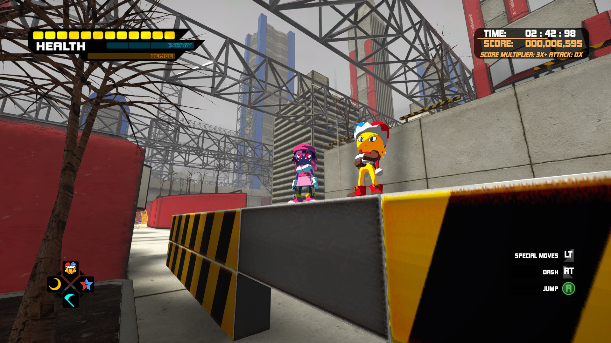
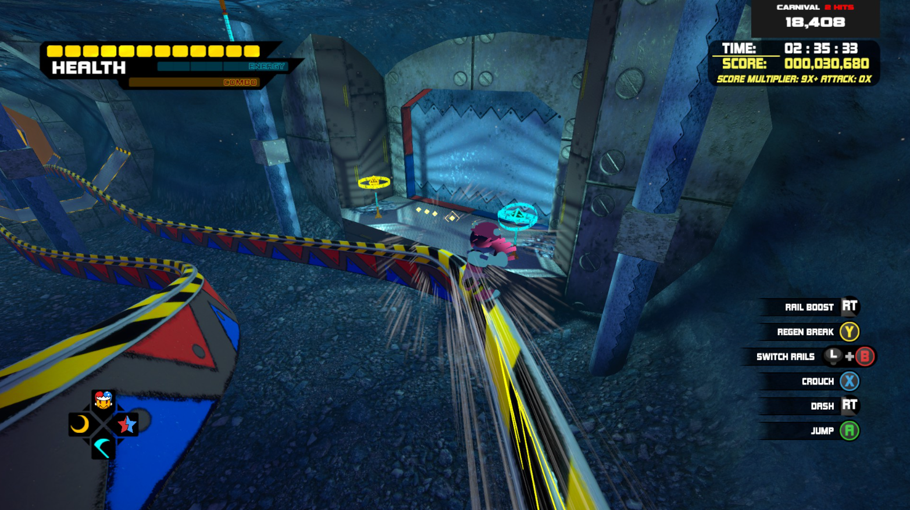
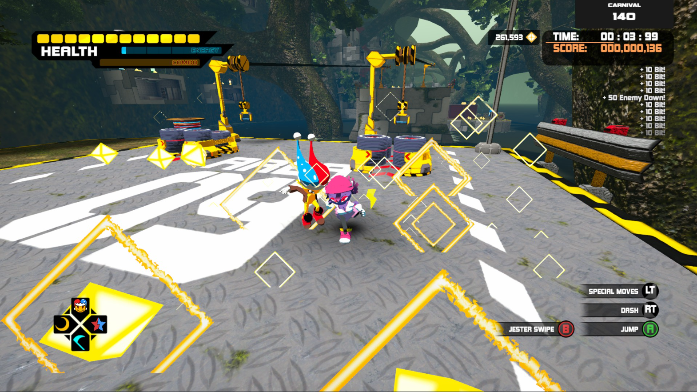
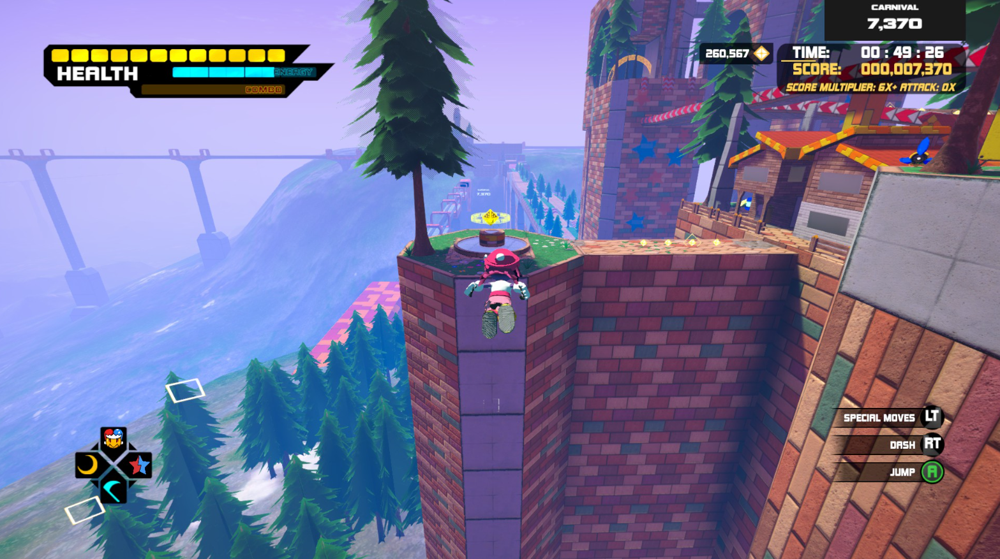

# Spark 3 Carnival Mod

Mod for the <ins>Steam version</ins> of Spark the Electric Jester 3. <ins>Install instructions below.</ins>

Source code is included in this repository — you can verify exactly what the mod does before running it.

Feature: Companion

• Float or Spark follows you around in stages. They swap depending on who you play. Note: Not multiplayer.

## Feature: Carnival Score

• Tracks how well you play overall, shown in top right. Encorages some exploration, while making every Bit count. Soft time limit of Gold Time + 60 seconds.

Carnival Score = Score * (20% penalty per hit) * (10% penalty per 10 seconds over time)

*Adds replay value to stages; Encorages you to try new routes to find hidden goodies and boost score. Makes you get better at the game, since you can't damage-boost through hazards easily.*

*General Carnival strategy: Get yellow capsules and small bits to increase multiplier. Green score capsules and yellow capsules are worth a lot. Enemy kills add up too.*

*Float has the longest jump in the game, especially by holding the button. She is generally recommended for Carnival Score.*

## Installation
  > Only works on the Steam version of Spark 3.

1. Download BepInEx 5 from its official github source. *(Use BepInEx 5 at your own risk, I make no warranty about it)*
2. Extract BepInEx into your Spark 3 folder (next to the .exe)
3. Run the game once and close it — this lets BepInEx set itself up
4. Download CarnivalMod.dll from Releases, put it in \Spark the Electric Jester 3\BepInEx\plugins\
5. Run the game

**If building from source**: You'll need to update the reference paths in CarnivalMod.csproj to match your own game install location.

## Disclaimers
Use "Spark 3 Carnival" at your own risk, no warranty.

This project is not affiliated with Feperd Games. Spark the Electric Jester 3 is created by Feperd Games.

This mod is not made for any monetary gain, only for fun.

*This project was written with Claude Code.*

